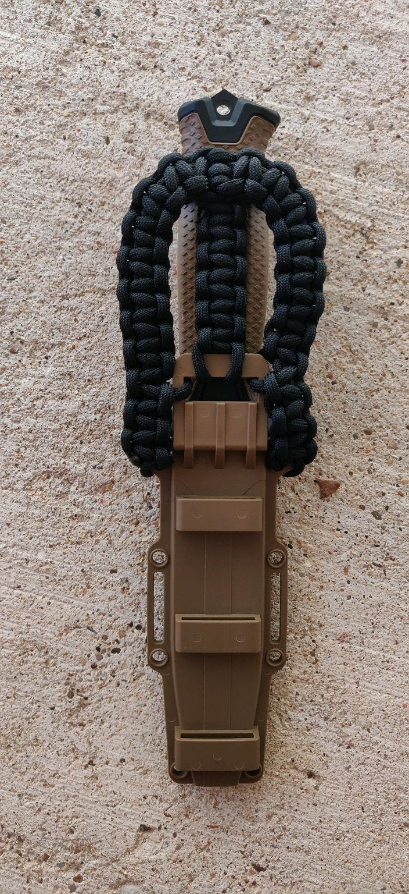
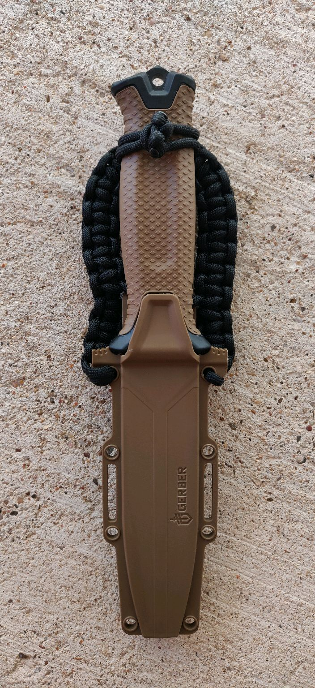

# Gerber Strongarm

https://www.gerbergear.com/en-us/shop/knives/all-knives/strongarm-coyote-brown-plain-edge-30-001058

I bought a Gerber Strongarm this weekend to replace my Becker BK16 as my main
bush knife. The BK16 blade shattered on me as I was trying to baton it through a
pine knot (not even hardwood), so I went with the Strongarm instead because it
has 1) a slighly thicker and sturdier blade, and 2) slightly less brittle steel.

I didn't like the Strongarm's sheath very much, it rattled pretty loudly with
all of its extra straps and buckles, so I wove my own sheath top from paracord.

It feels pretty nice but I haven't field tested it yet. The clasp is a simple
toggle knot like [this](https://www.youtube.com/watch?v=tcwMNABlfNY). The rest
is just cobra weave, you can see where it starts and ends through the pics
hopefully.